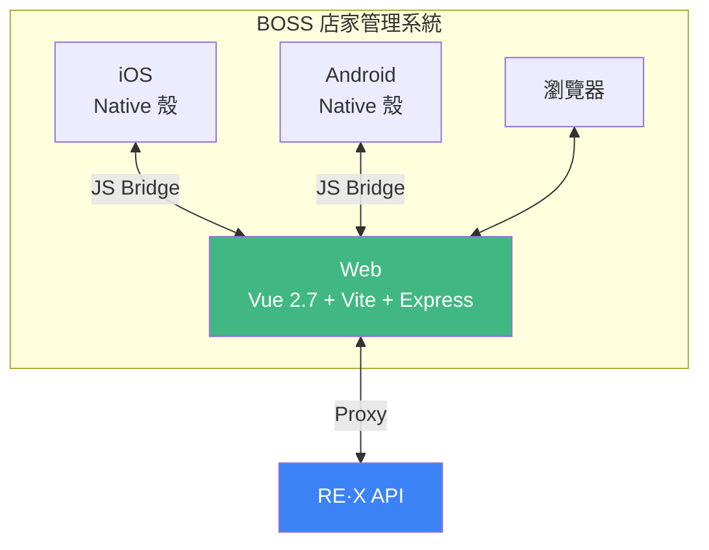

# 簡爾廷 David, Jian

應徵 {{ companyName || '【公司名稱】' }} {{ jobTitle || '【職缺名稱】' }}

  <a href="https://clipwww.github.io/personal/" target="_blank">Personal Site</a>
  ・
  <a href="https://github.com/clipwww" target="_blank">GitHub</a>

<!--
各位好，我是簡爾廷，英文名字是 David。
這份是詳細版自我介紹，我會用幾個代表專案說明我的經驗與能貢獻的價值。
-->

---

# 關於我

東海大學資訊管理研究所 (2013-2015) 
東海大學資訊工程學系 (2009-2013)

  **9 年以上** Web 開發經驗，專精於 Vue.js 生態系 

  具備 **Node.js / TypeScript** 後端服務開發經驗 

  熟悉從零到一建置**管理系統、會員平台**等服務型網站 

  擁有**金流**與**第三方點數平台**串接經驗 

  重視使用者體驗與程式碼品質，但保有彈性，不會固執己見 
  
  積極有責任感，樂於主動協助團隊成員 

  能夠獨立作業、解決問題，並持續自主學習

<!--  -->

  
  
  
  
  
  
  
  
  
  
  
  
  
  
  

<!--
我有 9 年以上 Web 開發經驗，主軸是 Vue.js 生態系，也能支援 Node.js 與 TypeScript 後端服務。
職涯中做過從零到一的平台建置，也做過長期維運與重構。
我特別熟悉金流與第三方點數整合，能在產品時程與品質之間取得平衡。
-->

---

# 工作經歷 — 阿爾伊 （近 8 年）

  
  

    
核心產品「<strong>RE·X 點數魔術師</strong>」— 點數整合應用平台

    
消費者可在合作店家進行交易獲得高額回饋點數，點數又可在下次消費折抵，並且還能夠綁定全家、HAPPYGO 點數來累積與折抵。

  

  
Web 專案

  

    

      
官方網站

      
Nuxt 2 SSR

    

    

      
BOSS 店家管理

      
 Hybrid App · Vue 2.7 · Vite

    

    

      
官方LINE@LIFF

      
Vue 3 · LIFF SDK

    

    

      
市場開發系統

      
Nuxt 2 · ElementUI

    

    

      
內部管理系統

      
Vue 2.7 · Vite · ElementUI · GraphQL

    

    

      
Vue 共用組件

      
Vue 2 / 3 · 私有 npm

    

  

  
後端服務 / 內部工具

  

    

      
全家會員與點數服務

      
TypeScript · Express · MySQL · Redis

    

    

      
簽到活動服務

      
TypeScript · Express · MySQL · Redis · Cron

    

    

      
藍新商家申請服務

      
TypeScript · Express · MySQL · SFTP · Cron

    

    

      
藍新交易查詢工具

      
Nuxt4 · NuxtUI

    

  

  金流串接：TapPay / Stripe / 藍新
  第三方點數串接：全家 / HAPPYGO

<!--
這是我待最久的一段經歷，在阿爾伊接近 8 年。
核心產品是 RE·X 點數魔術師，場景涵蓋交易、點數累積折抵與跨平台整合。
我在這裡從前端工程師一路做到資深前端工程師，參與前後台與後端服務的完整開發。
-->

---

# RE·X 官方網站

  
  
  
  
  

官方形象網站，提供平台介紹、合作店家列表、App 下載及聯絡客服等資訊，並支援多地區與多語系。 行銷活動以及 App 內的 WebView 頁面也由此專案提供。

擔任主要開發者，負責專案的架構設計與開發 
將第一版靜態 Html 的官網重構為 Nuxt 2 架構

- 提升 **Core Web Vitals**（LCP / FID / CLS）至良好等級
  - Lazy Loading、Nuxt Image 延遲圖片載入與圖片壓縮
  - LRU Cache 緩存靜態資料
  - Lazy Hydration 延遲非必要互動水合
  - 設計 Skeleton Loading 減少畫面偏移提升使用者體驗
- **多地區多語系** — 設計並實作 vue-i18n 架構，支援台灣 / 新加坡地區與繁中 / 簡中 / 英文語系
- **SEO** — 動態 Sitemap、Meta Tags、社群分享 OG Tags
- **Express 自訂路由** — 行銷短網址、App Deep Link 處理

<!--
RE·X 官方網站是公司對外的主要入口，我擔任主要開發者。
為了 SEO 與首屏體驗，我把第一版靜態網站重構成 Nuxt 2 SSR。
並導入快取、延遲載入與延遲水合，讓 Core Web Vitals 穩定在良好區間。
另外也負責多地區多語系、行銷短網址與 App Deep Link 的路由設計。
-->

---
layout: two-cols
---

# BOSS 店家管理系統

  
  
  
  
  

店家端後台管理系統，Hybrid App 形式同時支援 iOS、Android 與網頁，提供店家訂單查詢、交易分析、請款等功能。

- **Hybrid App** — 處理 Web 與 Native App 溝通
- **Vue/cli → Vite** — 大幅提升開發啟動速度
- 與同事協作用 **D3.js** 實作交易資料視覺化（訂單分析、會員分析）
- 規劃設計與實作廣宣物下載功能
  - 內部管理系統 CRUD 表單，提供同事管理廣宣物資料
  - 店家端使用 `Sharp` 帶入推薦碼與文案生成結帳立牌與行銷廣宣物
- 串接 TapPay, Stripe 實作台灣/新加坡店家加值功能

::right::

<!--
這個專案是一份程式碼同時支援 iOS、Android 與 Web 的 Hybrid App。
我負責 Web 與 Native 之間的橋接整合，也主導 Vue/cli 遷移到 Vite。
功能面包含 D3 交易視覺化、廣宣物產生，以及 TapPay、Stripe 的金流整合。
其中 TapPay 也被我封裝成共用組件，供其他專案重用。
-->

---
layout: two-cols
---

# 內部系統

### 市場開發系統

  
  
  
  

市場開發業務系統，提供市場部業務與在地合作夥伴進行店家開發功能，支援線上填寫表單、上傳檔案以及線上付款，能夠快速導入店家資料與開通藍新金流收款。

擔任主要開發者，負責專案從零到一的架構設計與開發

- 使用 ElementUI 根據需求欄位設計表單
- Zod 實作欄位之間連動的邏輯以及驗證
- **Google Maps API** 座標抓取與英文地址自動補全
- 證件**浮水印**處理 + **GCS** 加密上傳，確保資料安全
- 串接藍新金流**商家開通**流程

::right::

### Admin 內部管理系統

  
  
  
  

依權限控管提供各部門使用的內部管理系統

接手為主要維護、開發者

- **Nuxt1 → Vue/cli → Vite** 兩次建構程式遷移，大幅提升啟動與熱重載速度
- Apollo Client 串接 **GraphQL** API
- 依需求設計實作 **CRUD** 表單功能
- 建立共用組件庫（表單、表格、Modal），快速應對需求

<!--
左邊的市場開發系統是我從零到一建置的專案。
重點在複雜表單、地圖地址補全、文件安全上傳與藍新商家開通流程串接。

右邊是多部門共用的 Admin 系統，我是主要維護與開發者。
這個專案做過兩次建構遷移，也同步整理共用組件與 GraphQL 串接流程。
最終目標是提高團隊交付速度與維護效率。
-->

---

# LINE LIFF 應用程式

  
  
  

LINE Front-end Framework（LIFF）應用，提供會員可透過官方 LINE@ 的圖文選單開啟應用 進行帳號綁定、查看點數、掃碼交易與行動支付。由我從零到一設計與開發

- **LINE LIFF SDK** 實作會員LINE帳號綁定
- **html5-qrcode** 實作相機掃碼交易
  
應對當時 LIFF SDK 部分裝置不支援掃碼

- 串接金流藍新**嵌入式信用卡支付** 
  - 符合 PCI DSS 安全標準，只會取得 Token 不會接觸到卡片敏感資訊
- 實作 **Apple Pay on Web** 與 **Google Pay on Web**

<!--
這個 LIFF 應用是 RE·X 在 LINE 生態中的核心交易入口，由我從零到一設計與開發。
我負責會員綁定、掃碼交易、與藍新支付流程的整合。
在支付場景上，陸續落地 Apple Pay on Web、Google Pay on Web 與嵌入式信用卡支付。
同時把可重用的金流邏輯封裝成共用組件，降低後續專案接入成本。
-->

---

# 後端服務與內部工具

除了前端專案，也負責以下後端服務的開發

  
全家會員與點數服務

  

    
    
    
    
  

  
串接全家會員與點數平台 API，紀錄每筆請求/回應 以 RESTful API 提供內部專案串接使用

  
簽到活動服務

  

    
    
    
    
    Cron
  

  
規劃 API 路由與資料庫結構 排程檢查連續簽到狀態 & 發出提醒推播通知

  
藍新金流商家申請服務

  

    
    
    ssh2-sftp-client · Cron
  

  
負責開發 SFTP 補件上傳功能，將商家申請所需的檔案上傳至藍新金流指定 SFTP 伺服器，並排程定期拉取回覆檔案

  
藍新金流交易查詢工具

  

    
    
    
    Nuxt UI · Drizzle ORM
  

  
查詢交易狀態、取消授權/退款 核心 API Service 手寫，UI 與操作流程使用 <strong>AI Agent</strong> 規劃生成

<!--
除了前端，我也實際負責多個後端服務。
像是全家會員與點數串接、簽到活動排程、藍新商家申請 SFTP 流程，都是我主導開發。
另外藍新交易查詢工具則是核心 API 由我手寫，前台流程用 AI Agent 快速生成。
這段經驗讓我在前後端協作時更能快速定位與解決問題。
-->

---

# FunNow Group

核心產品「FunNow App」— 即時預訂享樂平台

### FunNow Manager Web

  
  
  
  

負責店家端平台的維護與新功能開發

- **vue/cli → Vite** — 啟動速度 **30-60s → 1-2s**
- 導入 **TypeScript** — 強化可讀性與可維護性
- 新功能改寫 **Composition API** & Vuex → **Pinia**
- 與設計師協作重構**日期時間選擇器**組件

日期時間選擇器組件 Demo

<!--
在 FunNow，我主要負責店家端 Manager Web 的維護與新功能。
我主導 vue/cli 遷移到 Vite，把啟動速度從 30-60 秒降到 1-2 秒。
同時導入 TypeScript、Composition API 與 Pinia，改善長期維護性。
也與設計師協作重構日期時間選擇器，提升實際操作體驗。
-->

---

# 個人專案 - 個人記錄視覺化

<!-- <a href="https://clipwww.github.io/blog/2021/08/25/google-sheets/" class="text-blue-500 text-xs" target="_blank">文章紀錄</a> -->
紀錄自己進影廳看電影以及進球場看棒球的資料，並將其視覺化呈現

- Google Sheets 作為資料庫
- D3.js, Chart.js 實作資料視覺化呈現
- Leaflet 實作地圖呈現球場位置

🎬 **電影院觀影紀錄**
- 場次/消費統計、影片版本/影城分佈
- 觀影時間熱力圖

⚾ **職棒入場紀錄**
- 觀賽統計、主場勝率
- 球場分佈圖

<!--
這是我持續維護的個人專案，用來記錄生活資料並做視覺化。
資料來源是 Google Sheets，前端用 Vue、D3、Chart.js 呈現。
專案主題是觀影與職棒進場紀錄，可以看到統計、熱點與地圖分佈。
它反映我在工作之外仍持續迭代產品與學習新技術。
-->

---
layout: two-cols
---

- **9 年以上** Web 開發經驗
- **專精 Vue.js 生態系**
- **後端服務開發經驗** - Node.js / TypeScript
- **從零到一設計並實作前端專案的經驗**
- **金流/第三方點數串接經驗**
- **團隊協作** - 積極主動負責，樂於溝通協調
- **獨立作業能力** - 自主學習，持續成長

::right::

🙇

<h2 class="text-2xl font-bold">感謝聆聽</h2>

📍 新北市, 台灣 
✉️ clipwww@gmail.com

  <a href="https://clipwww.github.io/personal/" target="_blank" class="text-blue-500 hover:underline">Personal Site</a>
  |
  <a href="https://github.com/clipwww" target="_blank" class="text-blue-500 hover:underline">GitHub</a>
  <!-- |
  <a href="https://clipwww.github.io/blog/" target="_blank" class="text-blue-500 hover:underline">Blog</a> -->

<!--
以上是我的詳細版自我介紹。
如果您想深入了解任一段經驗，我可以補充實作細節、踩坑與成果。
謝謝。
-->
