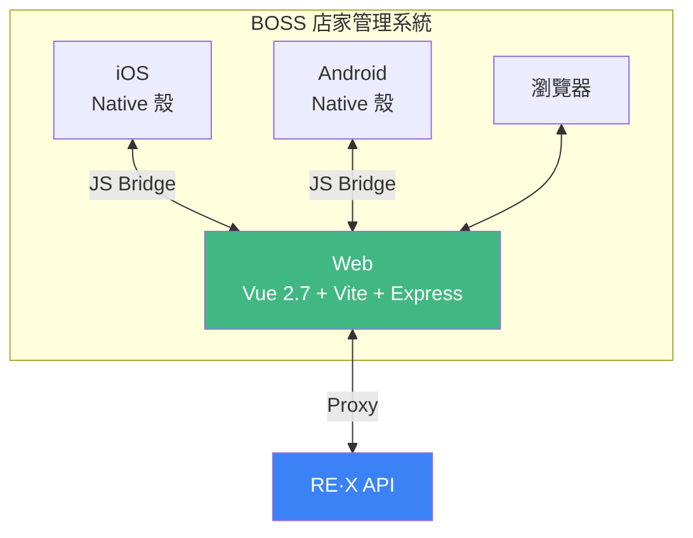

# 簡爾廷 David, Jian

應徵 {{ companyName || '【公司名稱】' }} {{ jobTitle || '【職缺名稱】' }}

  <a href="https://clipwww.github.io/personal/" target="_blank">Personal Site</a>
  ・
  <a href="https://github.com/clipwww" target="_blank">GitHub</a>

<!--
大家/各位/兩位好，我是簡爾廷，英文名字是 David。
-->

---

# 關於我

東海大學資訊管理研究所 (2013-2015) 
東海大學資訊工程學系 (2009-2013)

  擁有 **9 年以上**網站與網站應用程式開發經驗的經驗的前端工程師，專精於 Vue.js 及其生態系，並具備後端服務 Node.js, TypeScript 開發經驗。 

  熟悉從零到一建置後台管理系統、會員平台等面向終端使用者的服務型網站， 並擁有金流以及第三方點數平台串接實戰經驗 

  開發過程高度重視使用者體驗與整體品質， 但不會固執於己見，能靈活應對不同需求。 

  積極有責任感，樂於主動協助團隊，為共同目標努力。 

  具備獨立解決問題、有效完成分配任務與持續學習精進的能力。

  

  
  
  
  
  
  
  
  
  
  
  
  
  
  

<!--
大家好，我是簡爾廷，英文名字是 David。
我是一位有 9 年多經驗的前端工程師，主要專精在 Vue.js 與相關生態系，同時也具備 Node.js 後端開發能力。
熟悉從零到一建置後台管理系統、會員平台等服務型網站，擁有金流串接與第三方點數平台整合的實戰經驗。
我重視使用者體驗與程式碼品質，積極主動負責，樂於團隊協作。
-->

---

# 工作經歷 — 阿爾伊 （近 8 年）

  
  

    
核心產品「<strong>RE·X 點數魔術師</strong>」— 點數整合應用平台

    
消費者可在合作店家進行交易獲得高額回饋點數，點數又可在下次消費折抵，並且還能夠綁定全家、HAPPYGO 點數來累積與折抵。

  

  
Web 專案

  

    

      
官方網站

      
Nuxt 2 SSR

    

    

      
BOSS 店家管理

      
 Hybrid App · Vue 2.7 · Vite

    

    

      
官方LINE@LIFF

      
Vue 3 · LIFF SDK

    

    

      
市場開發系統

      
Nuxt 2 · ElementUI

    

    

      
內部管理系統

      
Vue 2.7 · Vite · ElementUI · GraphQL

    

    

      
Vue 共用組件

      
Vue 2 / 3 · 私有 npm

    

  

  
後端服務 / 內部工具

  

    

      
全家會員與點數服務

      
TypeScript · Express · MySQL · Redis

    

    

      
簽到活動服務

      
TypeScript · Express · MySQL · Redis · Cron

    

    

      
藍新商家申請服務

      
TypeScript · Express · SFTP · Cron

    

    

      
藍新交易查詢工具

      
Nuxt4 · NuxtUI

    

  

  金流串接：TapPay / Stripe / 藍新
  第三方點數：全家 / HAPPYGO

<!--
首先是我職涯中待最久的公司，阿爾伊，將近 8 年的時間。
公司核心產品「RE·X 點數魔術師」是一個點數整合應用平台，消費者可在合作店家進行交易獲得高額回饋點數，點數又可在下次消費折抵。
我在這家公司從前端工程師做到資深前端工程師，負責了非常多的專案，接下來幾頁會分別介紹。
-->

---

# RE·X 官方網站

  
  
  
  
  

官方形象網站，提供平台介紹、合作店家列表、App 下載及聯絡客服等資訊，並支援多地區與多語系。 行銷活動以及 App 內的 WebView 頁面也由此專案提供。

- **SSR 效能優化** — 提升 Core Web Vitals（LCP / FID / CLS）至良好等級
  - LRU Cache 緩存靜態資料、Lazy Hydration 延遲非必要水合、Nuxt Image 圖片壓縮
- **多地區多語系** — 設計並實作 vue-i18n 架構，支援台灣 / 新加坡 / 馬來西亞
- **SEO** — 動態 Sitemap、Meta Tags、社群分享 OG Tags
- **Express 自訂路由** — 行銷短網址、App Deep Link 處理

<!--
RE·X 官方網站是揭露公司資訊的形象官網。
為了良好的 SEO，使用 Nuxt.js 實作 SSR。
效能方面，實作了 LRU Cache 快取策略、Bot 偵測差異化處理、以及 Lazy Hydration 延遲水合來優化首屏載入速度。
在公司將產品從台灣擴展到馬來西亞跟新加坡的過程中，由我設計與實作多語系架構。
Express 自訂路由處理行銷短網址與 App Deep Link 的邏輯。
行銷活動以及 App 內的 WebView 頁面也由此專案提供。
-->

---
layout: two-cols
---

# BOSS 店家管理系統

  
  
  
  
  

店家端後台管理系統，Hybrid App 形式同時支援 iOS、Android 與網頁，提供店家訂單查詢、交易分析、請款等功能。

- **Hybrid App** — 處理 Web 與 Native App 溝通
- **Vue/cli → Vite** — 大幅提升開發啟動速度
- 與同事協作用 **D3.js** 實作交易資料視覺化（訂單分析、會員分析）
- 規劃設計與實作廣宣物下載功能
  - 公司內部管理系統 CRUD 表單，提供同事管理廣宣物資料
  - 店家端使用 `Sharp` 帶入推薦碼與文案生成結帳立牌與行銷廣宣物
- 串接 TapPay, Stripe 實作台灣/新加坡店家加值功能

::right::

<!--
RE·X BOSS 店家管理系統是 Hybrid App 的架構，一份程式碼同時運行於 iOS、Android 與 Web 三個平台，透過 JS Bridge 與 Native App 溝通。
我將專案從 Vue/cli 遷移至 Vite 來提升開發體驗，也用 D3.js 實作了交易分析、會員分析的資料視覺化功能。
另外也用 Sharp 跟 pdfmake 實作了結帳立牌的圖片生成功能。
金流方面，串接了 TapPay 支援台灣店家、Stripe 支援新加坡店家的付款與綁卡自動扣款，並將 TapPay 封裝為 Vue 組件提供不同專案使用。
-->

---
layout: two-cols
---

# 內部系統

### 市場開發系統

  
  
  

供市場部業務與合作夥伴使用的店家開發平台，由我從零到一設計開發。

- Zod 實作各欄位**連動驗證**，引導表單填寫
- **Google Maps API** 地址自動補全與座標抓取
- 證件**浮水印**處理 + **GCS** 加密上傳，確保資料安全
- 串接藍新金流**商家開通**流程

::right::

### RE·X Admin

  
  
  
  

依權限控管提供各部門使用的內部管理系統，接手為主要維護、開發者。

- **Nuxt1 → Vue/cli → Vite** 兩次建構遷移，大幅提升啟動與熱重載速度
- Apollo Client 串接 **GraphQL** API
- 建立 ElementUI 共用組件庫（表單、表格、Modal），快速應對各部門需求
- 依需求設計實作 **CRUD** 表單功能

<!--
市場開發系統是供業務使用的店家開發平台，由我從零到一設計與開發。
用 Zod 做表單驗證、串接 Google Maps API 自動補全地址、證件文件上傳 Google Cloud Storage 同時加上浮水印。
並且串接藍新金流的商家開通流程，包括 SFTP 補件與排程拉取回覆檔。

Admin 後台是公司最大的內部系統，依權限控管提供多部門使用。
經歷了從 Nuxt1 到 Vue/cli 再到 Vite 兩次建構工具的遷移。
我在這個專案中建立了共用組件庫，讓團隊可以快速應對不同部門的需求。
也有使用 Apollo Client 串接 GraphQL API 的經驗。
-->

---

# LINE LIFF 應用程式

  
  
  

LINE Front-end Framework（LIFF）應用，讓會員可透過官方 LINE@ 進行帳號綁定、查看點數、掃碼交易與行動支付。由我從零到一設計與開發。

- **LINE LIFF SDK** 實作會員登入綁定
- **html5-qrcode** 實作相機掃碼交易（應對 LIFF SDK 部分裝置不支援掃碼）
- 串接藍新金流實作 **Apple Pay on Web** 與 **Google Pay on Web**
- 串接藍新**嵌入式信用卡支付** — 符合 PCI DSS 安全標準
- 封裝金流相關功能為公司私有 **Vue** 共用組件 npm 套件

<!--
LINE LIFF 應用程式是 RE·X 在 LINE 官方帳號上的入口，由我從零到一設計與開發。
使用 LINE LIFF SDK 實作會員登入綁定，利用 html5-qrcode 實作相機掃碼功能，提供掃碼交易體驗。
2024 年 9 月上線了消費者支付功能，透過串接藍新金流的平台商架構實現消費者付款給店家。
當時除了 App 外，LINE 也是交易入口，因此實作了 Apple Pay on Web 與 Google Pay on Web。
2025 年初因應 PCI DSS 安全標準，串接了藍新的嵌入式信用卡支付。
我將這些金流相關的組件封裝為共用組件，並發佈到內部私有 npm 套件。
-->

---

# 後端服務與內部工具

除了前端專案，也負責以下後端服務的開發

  
全家會員與點數服務

  

    
    
    
    
  

  
串接全家會員與點數平台 API，紀錄每筆請求/回應 以 RESTful API 提供內部專案串接使用

  
簽到活動服務

  

    
    
    
    
    Cron
  

  
規劃 API 路由與資料庫結構 排程檢查連續簽到狀態 & 發出提醒推播通知

  
藍新金流商家申請服務

  

    
    
    ssh2-sftp-client · Cron
  

  
SFTP 補件上傳至藍新指定伺服器 排程定期拉取回覆檔案

  
藍新金流交易查詢工具

  

    
    
    
    Nuxt UI · Drizzle ORM
  

  
查詢交易資訊、取消授權/退款 核心 API Service 手寫，UI 與操作流程使用 <strong>AI Agent</strong> 生成

<!--
除了前端專案，我也負責了幾個後端服務的開發。
全家的部分，串接全家會員平台與點數交換平台的底層 Service 是由我開發的，以 RESTful API 的形式提供給內部其他專案串接使用。
簽到活動服務是我擔任主要開發者，規劃 API 路由與資料庫結構，並實作排程檢查連續簽到與發出提醒推播。
藍新金流商家申請服務負責 SFTP 補件上傳與排程拉取回覆檔。
另外還有一個有趣的專案是藍新金流交易查詢工具，核心的藍新 API Service 是我手寫的，但 UI 與整體操作流程是使用 AI Agent 生成的。
-->

---

# FunNow Group

核心產品「FunNow App」— 即時預訂享樂平台

### FunNow Manager Web

  
  
  
  

負責店家端平台的維護與新功能開發

- **vue/cli → Vite** — 啟動速度 **30-60s → 1-2s**
- 導入 **TypeScript** — 強化可讀性與可維護性
- 改寫 **Composition API** + Vuex → **Pinia**
- 與設計師協作重構**日期時間選擇器**組件

日期時間選擇器組件 Demo

<!--
在 FunNow，我負責的是店家端的後台管理系統
這個專案較為陳舊，在主管指示下我主導了建構工具的遷移
從 vue/cli 換到 Vite，啟動速度從原本 30 到 60 秒降到大約 1 到 2 秒
同時配合前端團隊的決定導入 TypeScript、Composition API 與 Pinia
主要目標是提升可維護性與團隊開發體驗

組件開發方面，我與設計師協作重構了日期、時間、日期範圍選擇器
提升了整體的使用體驗，這個 DEMO 是我自己另外做的展示頁面
-->

---

# 個人專案 - 個人記錄視覺化

<!-- <a href="https://clipwww.github.io/blog/2021/08/25/google-sheets/" class="text-blue-500 text-xs" target="_blank">文章紀錄</a> -->
利用 Google Sheets 作為資料庫  
紀錄自己進影廳看電影以及進球場看棒球的資料，並將其視覺化呈現

- 利用 Google Sheets 作為資料庫
- 使用 D3.js, Chart.js 實作資料視覺化呈現
- 使用 Leaflet 實作地圖呈現棒球場位置

🎬 **電影院觀影紀錄**
- 場次/消費統計、影片版本/影城分佈
- 觀影時間熱力圖

⚾ **職棒入場紀錄**
- 觀賽統計、主場勝率
- 球場分佈圖

<!--
再來說說我的 Side Project
這個是我主要還有在使用跟維護的個人專案
起初是用來練習當時剛正式發佈的 Vue 3 以及因公司專案接觸到的資料視覺化這塊
利用 Google Sheets 作為資料庫，記錄下自己進電影院看電影跟進場看棒球的資料後
將這些資料視覺化呈現出來
就是可以看到消費統計、每個月的次數、觀影時間熱點
棒球的話就是勝率跟球場次數以及分布
-->

---
layout: two-cols
---

# 最後

### 核心優勢

- **9 年以上** 網站與網站應用程式開發經驗
- **專精 Vue.js 與生態系**
- **擁有後端開發經驗** - Node.js / TypeScript
- **金流串接經驗** - TapPay / Stripe / 藍新
- **第三方點數串接經驗** - HAPPYGO / 全家點數
- **重視 UX 與品質** - 確保功能穩定性與可用性
- **團隊協作** - 積極主動負責，樂於溝通協調

::right::

🙇

<h2 class="text-2xl font-bold">感謝聆聽</h2>

📍 新北市, 台灣 
✉️ clipwww@gmail.com

  <a href="https://clipwww.github.io/personal/" target="_blank" class="text-blue-500 hover:underline">Personal Site</a>
  |
  <a href="https://github.com/clipwww" target="_blank" class="text-blue-500 hover:underline">GitHub</a>
  <!-- |
  <a href="https://clipwww.github.io/blog/" target="_blank" class="text-blue-500 hover:underline">Blog</a> -->

<!--
以上是我的自我介紹
最後再次強調我的核心優勢
如果有任何問題，歡迎隨時提問，謝謝！
-->
